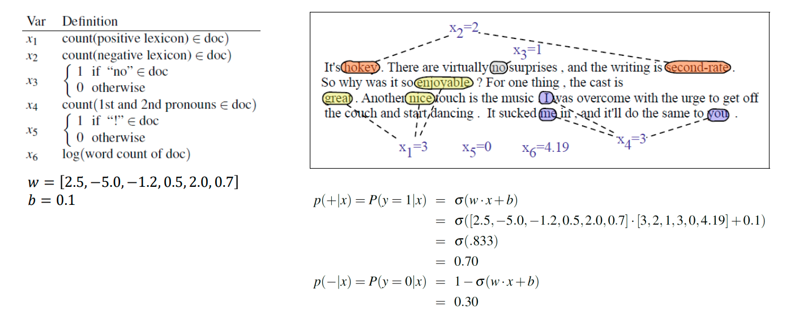
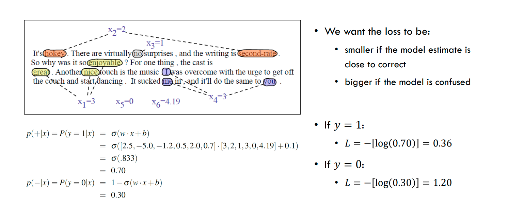
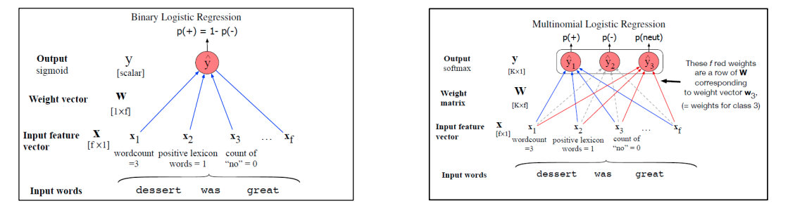

# Logistic Regressions

## Generative vs Discriminative Classifiers

The goal of classification is: **given a document assign a class to that document**. $\gamma D \rarr C$ where D is the set of documents and C is the set of classes.

Therefore we want to know $P(c|d)$, meaning the probability of having class $c$ given the document $d$.

### Generative Classifiers
In **generative models** the question is reversed: how likely is class c to produce document d, what is the probability of having the document d given class c?. $P(d|c)$

This is why they are called generative models because they ask the question of how likely is that document to be produced by a certain class, then the model chooses the class with the highest probability of producing said class.

$$\hat{c} = \argmax_{c \in C} P(d|c)P(c)$$

Some examples of generative classifiers are:
- Naive Bayes, Hidden Markov Models...

### Discriminative Classifiers

**Discriminative Models** try to directly compute $P(c|d)$ 

$$\hat{c} = \argmax_{c \in C} P(c|d)$$

Some examples of these models are:
- Logistic Regressions
- Decision Trees
- Suport Vector Machines
- Neural Networks
- Conditional Random Fields.

## Comparing the two types of models

Naive Bayes has overly strong **conditional independence assumptions** meaning
that if two features are correlated it will treat these two features as
independent ones, overestimating such evidance

- **Discriminative Classifiers** like Logistic Regression tend to perform better when there are correlated features
- **Naive Bayes** is very easy to implement and fast to train as it doesn't have an optimization step

# Logistic Regression

In the context of NLP, Logistic Regression is used as a baseline model for supervised machine learning classifiers algorithms.

Logistic Regression has a very [close relation with **Neural Networks**](https://www.datasciencecentral.com/logistic-regression-as-a-neural-network/) the latter can be thought as several Logistic Regression Models stacked up!.

### Components of a Probabilistic Classifier

1. A **feature representation** of the input
    - Given a document $d$, represent it as a feature vector $x = [x_1,x_2,....x_n]$
    - Here the techniques of **text processing** are used
1. A **classification function** based on (**sigmoid** or **softmax**)
    - Compute the estimated class $\hat{y}$ given $P(y|x)$ *note the discriminative formula$
1. An **objective function** (*cross entropy loss*)
    - For learning through error minimization on the training data set
1. An algorithm for **optimizing the objective function** (*stochastic gradient descent* SGD)

## The Sigmoid Function

Each **feature $x_i$** as an associated weight $w_i$
- $w_i \gt 0$ feature $i$ is associated with the class
- $w_i \lt 0$ feature $i$ is not associated with the class

- A bias term is added to the weighted inputs

$$ z = \sum_{i=1}^{n} x_iw_i + b$$
$$ z = w \cdot x + b$$

The **sigmoid** function maps values of $z$ to the range of $[0,1]$, the range of a probability.

$$\sigma(z): \R \rarr [0,1]$$

$$y =  \sigma(z) = \frac{1}{1 + e^{-z}}$$

From the value of the *sigmoid* we can establish a decision boundary:

$$ \hat{y} = \begin{cases}
    1 \text{ if } P(y=1|x) \gt 0.5 \\ 
    0 \text{ otherwise}
\end{cases}$$

We choose class $y=1$ if the probability given by the sigmoid function is greater than $0.5$

Here goes the example of the task of sentiment analysis using logistic regression as the classifier model

## Scaling Input Features

Rescaling feature values so that they have comparable ranges

...But Why?
- **Improved Convergence** (speed and stability), in particular when using gradient based classifiers
- **Better comparison** of feature importance
- More effective distance calculations (for methods such as kNNs)
- Improved model **generalization**

**Z-score**, where $x_i'$ is the scaled feature,$\mu_i$ is the mean and $\sigma_i$ is the standard deviation.

$$x_i' = \frac{x_i - \mu_i}{\sigma_i}$$

**Normalization** its a function from $\R \rarr [0,1]$ 

$$x_i' = \frac{x_i - min(x_i)}{max(x_i) - min(x_i)}$$

## Cross Entropy Loss

Learning through the minimization of error on training examples, how do we
calculate how far the model is from the correct answer? Distance?

**Loss Function $L(\hat{y},y)$** where $hat{y}$ is the class predicted by the model and $y$ is the real class.
- Given $\hat{y} = \sigma(w\cdot x + b)$,  how distant are we from $y$?

We want to learn the weights to maximize the probability of the correct label $P(y|x)$

Given that  $P(y=1|x) = \hat{y} \lrarr P(y=0|x) = 1 - \hat{y}$ and we also know that $y \in \set{0,1}$, so instead of having the formula for $P(y|x)$ splitted in branches like:

$$P(y|x) = \begin{cases}
    \hat{y}, & y = 1 \\
    1 - \hat{y},  & y = 0 
\end{cases}
$$

We can abuse the fact that $x^0 = 1$, $x^1 = x$, $ 0\times x = 0$ and $1 \times x = x$ to combine these two branches into one:

$$P(y|x) = \hat{y}^y(1-\hat{y})^{1-y}$$

Now if we apply the logarithm to both sides:

$$\begin{align*}
    \log P(y|x) &= \log (\hat{y}^y(1-\hat{y})^{1-y}) \\
    &= \log \hat{y}^y + \log(1-\hat{y})^{1-y} \\
    &= y\log \hat{y} + (1-y)\log(1-\hat{y})
\end{align*}
$$

**Cross Entroy Loss** is the function we want to minimize:

$$  \begin{align*} L_{CE}(\hat{y},y)&= - \log P(y|x) \\
&=  y\log \hat{y} + (1-y)\log(1-\hat{y}) \land \hat{y} = \sigma(w \cdot x + b)  \\
&= y\log \sigma(w \cdot x + b) + (1-y)\log(1 - \sigma(w \cdot x + b))
\end{align*}
$$

If the model is correct,for documents $x_0,x_1$ of the same classes of their indices: 
$P(y=1|x_1) = 1$ \land $P(y=0|x_0) = 1$  so the cross entropy loss function in these cases will be $-log(1) = 0$

In the cases where the model is wrong and $P(y |x) = 0$, let $w = P(y|x)$:

$$\lim_{w\rarr 0} -\log w = \infty$$

## Gradient Descent

Optimizing the objective function means **finding the optimal weights to minimize the loss functon**

**Gradient Descent**:
1. Figure out the highest slope (the gradient of the loss function at the current point)
1. Move downhill in the opposite direction

$$\frac{1}{m} \sum_{i=1}^m L_{CE}(\hat{y}^i,y^i)$$

$m$ is the set of training data such that $m_i$ corresponds to a set of features $x^i$ and a label $y^i$

So we can say that $\hat{y}^i = f(x^i,\theta)$ where $\theta$ is the set of weights that **parametrize function $f$**

Therefore the gradient descent aims at finding the set of weights that minimizes the averager of the loss function:

$$ \hat{\theta} = \argmin_\theta \frac{1}{m} \sum_{i=1}{m} L_{CE}\Bigl( f(x^i,\theta),y^i\Bigr)$$

In logistic regression the **loss function is convex** and the **gradient descent** is an **iterative process** where in each iteration we move each weight by its *impact on the loss function* scaled by a **learning rate**

Considering a function $f$ with just a single weight parameter:

$$w^{t+1} = w^t - \eta \frac{\partial}{\partial w} L(f(x,w),y)$$

Scaling this process to $n$ dimensions, we get a vector $\theta$ of weights:

$$\theta_{t+1} = \theta_t - \eta\nabla L(f(x,\theta),y)$$

Where $\theta$ is the vector of all the weights and the bias.

And i think that the function $L$ is refering to:

$$L = \frac{1}{m}\sum_{i=1}^m L_{CE}(f(x^i,\theta),y^i)$$

So its gradient would show the effect of the changing of each weight on the average loss on the training data.

## Gradient For Logistic Regression

Remember that: $\hat{y} = \sigma(w\cdot x + b)$

$$\begin{align*} \frac{\partial}{\partial w_j}L_{CE}(\hat{y},y) &=
(\hat{y}-y)x_j \\
&= [\sigma(w' \cdot x + b) - y ]x_j
\end{align*} $$

Meaning that the gradient descent for logistic regression is the difference between the **real value** $y$ and the newly predicted value $hat{y}$ with $w_j$ infinitesimally changed, scaled by the corresponding feature.

# Copy Slide 17 here

## Batch vs Mini-Batch Training

**Batch training**: compute the gradient over the entire dataset.

**Mini Batch Function**: train on a group of $m$ examples, less then the entire dataset.
   - Mini Batches can be vectorized for parallel processing To increase computational efficiency
   
Now we introduce the *Cost function*, the function I'v been refering as $L$ accross the document.

$$Cost(\hat{y},y) = L = \frac{1}{m}\sum_{i=1}^m L_{CE} (\hat{y}^i,y^i)$$

We had the gradient $\frac{\partial}{\partial w_i}L_{CE}(\hat{y},y) = (\hat{y} - y)x_i$

Now for minibatching we have:

$$\frac{\partial Cost(\hat{y},y)}{\partial w_i} = \frac{1}{m} \sum_{k=0}^m \bigl[\sigma(w \cdot x^k + b) - y^k\bigr]x_i^k$$

Where $k$ corresponds to each entry in the matrix $m$ meaning each entry of $m$ corresponds to an array of features $x^k$ and a label $y^k$

## Regularization

**Overfitting**: is giving importance to features that accidentaly correlate with the class.
- An overfitted model will not generalize well to test data
- A **4-grams** model in a small dataset will tend to memorize the training data but it will not do well in the testing data
- Features that are not related to the target label, but which occur accidentally in the training data.

**Regularization** is a technique to avoid overfitting by penalizing excessive feature weights.

Now instead of only minimizing the Cross Entropy Loss Function we also want to minimize a regularization term $\alpha R(\theta)$

$$ \hat{\theta} = \argmin_\theta \frac{1}{m}\sum_{i=1}^{m}\Bigl[L_{CE}(f(x^i,\theta),y^i))\Bigr] + \alpha R(\theta)$$

Why is it important to scale feature weights?

Remember that in the formula, **the derivative of the weight is scaled by the
corresponding feature**, so if this feature's value is too high it can denote a false importance in the gradient, resulting in overfit.

We will look at two Regularization functions, **L1** and **L2**

### L1 Regularization

Uses the sum of the absolute weight values: the **Manhattan distance**

$$R(\theta) = ||\theta||_1 = \sum_{i=1}^n |\theta_i|$$

- It prefers sparse vectors with some larger weights but many weights set to 0.

> Sparser weight vectors means to fewer features and incresed model efficiency

### L2 Regularization

Uses the square of the weight values: the **euclidean distance**

$$R(\theta) = ||\theta||_2^2 = \sum_{i=1}^n \theta_i^2$$

Prefers vectors with many small weights.

[Here](https://explained.ai/regularization/index.html) is an excellent article comparing the two regularization methods.

# Multinomial Logistic Regression

Moltinomial classifiers want to know the probability of **each potential class**

So instead of having a function that maps an array of features to a probability, we map the array of features into an array of probabilities, one for each label.

**Softmax function** can be seen as a generalization of the sigmoid function, that takes a  vector of $k$ arbitrary values and maps them to probabilities that sum up to 1.

$$softmax(z_i) = \frac{exp(z_i)}{\sum_{j=0}^k exp(z_j)},  1 \leq i \leq k$$

The softmax returns a vector $z$ of dimensions $[1,k]$ such that $\sum_{i=1}^k z_i = 1$

As we are predicting multiple classes we need a different array of weights for $\theta$ for each class.

- In multinomial classification, each feature can be evidence for or against for each class
- In binary classification, each feature weight can be evidence for or against  $y=1 \lor y=0$ and its absolute value indicates how important the feature is.

For example in the task of sentiment analysis with the classes `positive,negative,neutral`

| Feature  | Definition               | $w_5$ positive | $w_5$ negative | $w_5$ neutral |
| -------- | ------------------------ | -------------- | ------------- | ------------- |
| $f_5(x)$ | Bool:the presence of `!` | 3.5            | 3.1           | -5.3          |

The weight of feature 5 for the neutral class being negative means that it disencourages the model to classify documents containing `!` as being **neutral**

## Multinomial Logistic Regression Loss 

$$ 
p(y_k=1|x) = \frac{\exp(w_k \cdot x + b_k)}{\sum_{i =1}^K \exp(w_i \cdot x + b_i) }
$$

$$ p(y_k=0|x) = 1 - p(y_k=1|x) = \sum_{i = 1}^K p(y_i = 1|x) , i \not= k$$

The true label y will be a vector with K elements, each corresponding to a class. $K-1$ elemenst will be 0 and 1 will be 1.

The loss function of multinomial logistic regression is just the log of the output probability of the corresponding class.

$$L_{CE} = - \log \hat{y_c}, \text{ where c is the correct class}$$

Doesn't this ommit the effect of other classes? It seems like we are not taking into account their effect.
- No because we need to remember that the output probability of the correct class considers the output of every other class as their sum is equal to 1. So if the model is faulty, the loss function will be high as the probability of the correct class will be low.

Consider $z = [0.25,0.25,0.5]$ and that the correct class is $c=3 \rarr z_3 = 0.5$ 

Therefore the $L_{CE} = -\log \frac{1}{2} = 1$

